## 1. JUC是什么

### 1.1 概述

>juc是jdk8提供的高并发工具类，都是线程安全的，在java.util.concurrent包下。api如下图：
>
>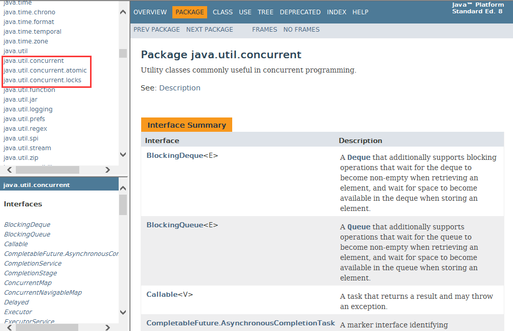

### 1.2 线程和进程

#### 进程/线程是什么？

**进程**

>进程：进程是一个具有一定独立功能的程序关于某个数据集合的一次运行活动。它是操作系统动态执行的基本单元，在传统的操作系统中，进程既是基本的分配单元，也是基本的执行单元。

**线程**

>线程：通常在一个进程中可以包含若干个线程，当然一个进程中至少有一个线程，不然没有存在的意义。线程可以利用进程所拥有的资源，在引入线程的操作系统中，通常都是把进程作为分配资源的基本单位，而把线程作为独立运行和独立调度的基本单位，由于线程比进程更小，基本上不拥有系统资源，故对它的调度所付出的开销就会小得多，能更高效的提高系统多个程序间并发执行的程度。


#### 进程和线程的例子

**进程案例**

>比如你在玩游戏的过程又在使用网易云音乐听歌，这个两个俗称进程。

**线程案例**

> 比如你在写代码的时候，使用的工具是IDEA，你在编写代码过程，工具帮你检查语法错同时也在帮你保存，这俗称叫做多线程操作。

#### 线程的状态

```java
//线程包含6种状态
public enum State {
   
    NEW,(新建)
      
    RUNNABLE,（准备就绪）
      
    BLOCKED,（阻塞）
      
    WAITING,（不见不散）
      
    TIMED_WAITING,（过时不候）
      
    TERMINATED;(终结)
}
```

#### wait/sleep的区别？

>线程调用这两个方法都是暂停方法作用，wait是Object类的方法，sleep是Thread静态类的方法
>
>wait是放开手去睡，同时也放开手中的锁。
>
>sleep紧握手中的锁去睡，醒了手中的锁还在。

####  什么是并发？什么是并行？

**并发**

> 同一个资源有多条线程抢用，多个线程对一个点。
>
> 案例：比如各大电商网站的 秒杀抢购活动。

**并行**

> 多项工作一起执行，之后再汇总。
>
> 案例：泡方便面，电水壶烧水，一边撕调料倒入桶中


## 2. JUC 之 Lock锁

### 2.1 Synchronized

> > 1.synchronized修饰的方法，当创建实例调用它，锁是当前对象，只要有一个方法去调用了synchronized方法，其他的线程都只能等待，等待那条线程释放完。
> > 2.synchronized锁实现同步的基础是：Java中的每一个对象都可以作为锁
> > 2.1创建两个资源对象了，锁是不同一把锁。
> > 3.表现为一下三种
> > 3.1对于静态同步方法锁是当前类的Class对象
> > 3.2对于普通同步方法，锁是当前对象，即为锁的是当前this
> > 3.2对于同步代码块，锁是括号里面配置的对象。 

**Synchronized 案例代码**

```java
package com.laiqilin.juc;

import java.util.concurrent.TimeUnit;
class Phone {
    public static synchronized void sendEmail() throws InterruptedException {
        TimeUnit.SECONDS.sleep(3);
        System.out.println(Thread.currentThread().getName() + "----Phone.sendEmail");
    }

    public  synchronized void sendSMS() {
        System.out.println(Thread.currentThread().getName() + "----Phone.sendSMS");
    }
  
    //普通方法
    public String sayHello() {
        return Thread.currentThread().getName() + "----Hello Thread......";
    }
}

public class LockDemo {

    public static void main(String[] args) throws Exception {
        //资源类
        Phone phone = new Phone();
        Phone phone2 = new Phone();
        //创建线程
        new Thread(() -> {
            try {
                phone.sendEmail();
            } catch (InterruptedException e) {
                e.printStackTrace();
            }
        }, "A").start();

        //第二条线程
        new Thread(() -> {
            phone.sendSMS();
        }, "B").start();
        //第三条线程
        new Thread(() -> {
            System.out.println(phone.sayHello());
        }, "C").start();
    }
}
```

### 2.2 Lock锁

**概述**

> lock锁是jdk8提供的新的多线程锁，提供更多锁机制，api如图：
>
> 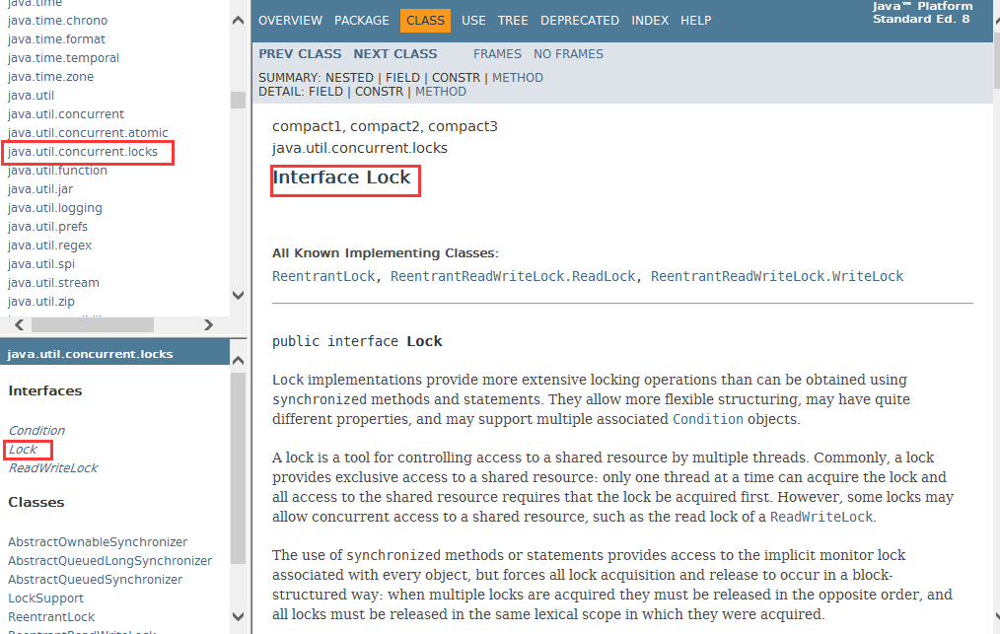
>
> 

**Lock接口的实现ReentrantLock可重入锁**

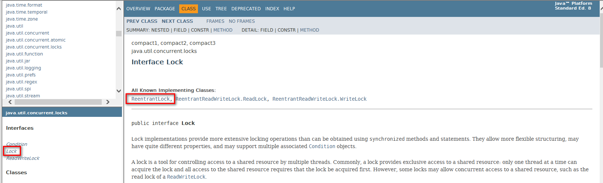

案例代码

```java
class X {
   private final ReentrantLock lock = new ReentrantLock();
   // ...
 
   public void m() {
     lock.lock();  // block until condition holds
     try {
       // ... method body
     } finally {
       lock.unlock()
     }
   }
 }
```

**synchronized与Lock的区别** 

> 两者区别：
>
> 1.首先synchronized是java内置关键字，在jvm层面，Lock是个java类；
> 2.synchronized无法判断是否获取锁的状态，Lock可以判断是否获取到锁；
> 3.synchronized会自动释放锁(a 线程执行完同步代码会释放锁 ；b 线程执行过程中发生异常会释放锁)，Lock需在finally中手工释放锁（unlock()方法释放锁），否则容易造成线程死锁；
> 4.用synchronized关键字的两个线程1和线程2，如果当前线程1获得锁，线程2线程等待。如果线程1阻塞，线程2则会一直等待下去，而Lock锁就不一定会等待下去，如果尝试获取不到锁，线程可以不用一直等待就结束了；
> 5.synchronized的锁可重入、不可中断、非公平，而Lock锁可重入、可判断、可公平（两者皆可）
> 6.Lock锁适合大量同步的代码的同步问题，synchronized锁适合代码少量的同步问题。

### 2.3 创建线程方式

**线程的创建方式有四种**

> 第一种: 继承Thread类
>
> ```java
> public class  MyThread extends Thread{}
> Thread thread = new Thread(); thread.start();
> ```
>
> 第种二： 实现runnable接口
>
> ```java
> class MyThread implements Runnable//新建类实现runnable接口
> new Thread(new MyThread,...)
> ```
>
> 这种方法会新增类，有更新更好的方法
>
> 匿名内部类写法：
>
> new Thread(new Runnable() {
>
> ```java
> @Override
> public void run() { }
> }, "your thread name").start();
> ```
>  这种方法不需要创建新的类，可以new接口
>
> lambda表达式写法（推荐）：
>
> ```java
> new Thread(()->{},"Thread Name").start();
> ```
>
> 第三种：使用FutureTask类中实现 Callable接口创建线程 
>
> ```java
> FutureTask<String> task = new FutureTask<>(new Callable<String>() {
>             @Override
>             public String call() throws Exception {
>                 return "Callable线程...";
>             }
>         });
>         new Thread(task,"A").start();
>         String s = task.get();
>         System.out.println("s = " + s);
> ```
>
> 第四种：使用自定义线程池创建线程（ThreadPoolExecutor）,  jdk自带的线程池（Executors.new....）

> ```java
>        /**
>          * 自定义线程池
>          */
>         ExecutorService threadPool = new ThreadPoolExecutor (
>                 2, //常驻线程数
>                 5, //能够容纳的线程数
>                 2L,//多余线程存活时间
>                 TimeUnit.SECONDS,//keepAliveTime单位
>           		//任务队列（阻塞队列），被提交但是没有执行在队列等待中
>                 new ArrayBlockingQueue<> (3),
>                 Executors.defaultThreadFactory (),//用于生成线程池中工作线程的工厂，默认
>                 //new ThreadPoolExecutor.AbortPolicy ()
>                 //new ThreadPoolExecutor.DiscardPolicy ()
>                 //new ThreadPoolExecutor.CallerRunsPolicy ()
>                 new ThreadPoolExecutor.DiscardOldestPolicy ()
>         );//当队列满了，jdk自带的拒绝策略，四种拒绝策略
> ```
>
> ```java
> //jdk自带的线程池（不推荐使用，详情请参考阿里巴巴开发手册） 
> ExecutorService threadPool = Executors.newCachedThreadPool ();
> ```


## 3. 线程间通信

### 3.1 线程怎么通信？

> 1. 生产者+消费者
> 2. 通知等待唤醒机制

**多线程编程模板**

> 判断 + 干活 + 通知

### 3.2 Java里面如何进行工程级别的多线程编写

> 1 多线程变成模板（套路）-----上
>
>   1.1  线程    操作    资源类  
>
>   1.2  高内聚  低耦合
>
> 2 多线程变成模板（套路）-----下
>
>   2.1  判断
>
>   2.2  干活
>
>   2.3  通知

**synchronized实现多线程通信**

> 案例：
>
> * 现在两个线程，
>
>
>  * 可以操作初始值为零的一个变量，
>  * 实现一个线程对该变量加1，一个线程对该变量减1，
>  * 交替，来10轮。
>
> ```java
> //代码实现
> //资源类
> class ShareDataOne
> {
>   private int number = 0;//初始值为零的一个变量
>  
>   public synchronized void increment() throws InterruptedException 
>   {
>     //多线程中使用if判断会出现线程虚假唤醒现象，所以解决方案 使用while循环代替 
>     //1判断
>     /* if(number !=0 ) { 
>        this.wait();
>      }*/
>     while(number!=0){
>       this.wait();
>     }
>      //2干活
>      ++number;
>      System.out.println(Thread.currentThread().getName()+"\t"+number);
>      //3通知
>      this.notifyAll();
>   }
>   
>   public synchronized void decrement() throws InterruptedException 
>   {
>     //多线程中使用if判断会出现线程虚假唤醒现象，所以解决方案 使用while循环代替 
>      // 1判断
>      /*if (number == 0) {
>        this.wait();
>      }*/
>      while(number!=0){
>       this.wait();
>     }
>      // 2干活
>      --number;
>      System.out.println(Thread.currentThread().getName() + "\t" + number);
>      // 3通知
>      this.notifyAll();
>   }
> }
>
> public class NotifyWaitDemoOne
> {
>   public static void main(String[] args)
>   {
>      ShareDataOne sd = new ShareDataOne();
>      new Thread(() -> {
>        for (int i = 1; i < 10; i++) {
>           try {
>             sd.increment();
>           } catch (InterruptedException e) {
>             // TODO Auto-generated catch block
>             e.printStackTrace();
>           }
>        }
>      }, "A").start();
>      new Thread(() -> {
>        for (int i = 1; i < 10; i++) {
>           try {
>             sd.decrement();
>           } catch (InterruptedException e) {
>             // TODO Auto-generated catch block
>             e.printStackTrace();
>           }
>        }
>      }, "B").start();
>   }
> }
>
> ```
>
> **注意**
>
> > ~~注意多线程之间的虚假唤醒~~
> >
> > 解决方法：**多线中使用while代替if判断**

**jdk8方式实现上面的案例**

> 代替传统的实现线程wait()和noifyall() ;对标实现如图：
>
> 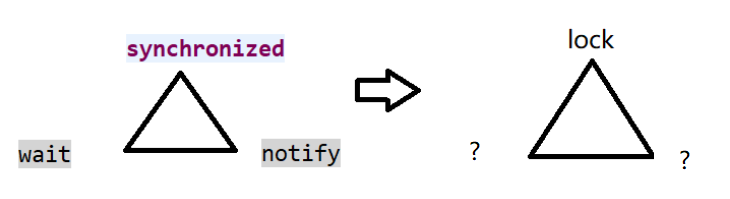

**Condition：查看API，java.util.concurrent**

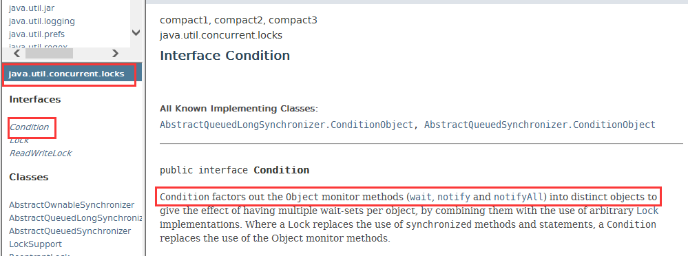

> 代码实现：
>
> ```java
> //创建资源类
> class Aircondition {
>     private int number = 0;
>     //获取锁对象
>     private Lock lock = new ReentrantLock();
>     //返回用于此锁实例的条件实例
>     Condition condition = lock.newCondition();
>
>     public void decrement() {
>         lock.lock();
>         try {
>             while (number == 0) {  //使用while代替if解决线程虚假唤醒
>                 //使当前线程等待，直到发出信号或中断为止
>                 condition.await();
>             }
>             //干活
>             number--;
>             System.out.println(Thread.currentThread().getName() + "\t" + number);
>             //通知
>             //唤醒所有等待的线程
>             condition.signalAll();
>         } catch (InterruptedException e) {
>             e.printStackTrace();
>         } finally {
>             lock.unlock();
>         }
>     }
>
>     public void increment() {
>         lock.lock();
>         try {
>             while (number != 0) {  //使用while代替if解决线程虚假唤醒
>                 condition.await();
>             }
>             //干活
>             number++;
>             System.out.println(Thread.currentThread().getName() + "\t" + number);
>             //通知
>             condition.signalAll();
>         } catch (InterruptedException e) {
>             e.printStackTrace();
>         } finally {
>             lock.unlock();
>         }
>     }
> }
>
> public class ProdConsumerDemo {
>     public static void main(String[] args) {
>         Aircondition aircondition = new Aircondition();
>         new Thread(() -> {
>             for (int i = 1; i <= 10; i++) {
>                 try {
>                     TimeUnit.SECONDS.sleep(1);
>                     aircondition.increment();
>                 } catch (InterruptedException e) {
>                     e.printStackTrace();
>                 }
>             }
>         }, "A").start();
>
>         new Thread(() -> {
>             for (int i = 1; i <= 10; i++) {
>                 try {
>                     TimeUnit.SECONDS.sleep(1);
>                     aircondition.decrement();
>                 } catch (InterruptedException e) {
>                     e.printStackTrace();
>                 }
>             }
>         }, "B").start();
>
>         new Thread(() -> {
>             for (int i = 1; i <= 10; i++) {
>                 try {
>                     TimeUnit.SECONDS.sleep(1);
>                     aircondition.increment();
>                 } catch (InterruptedException e) {
>                     e.printStackTrace();
>                 }
>             }
>         }, "C").start();
>
>         new Thread(() -> {
>             for (int i = 1; i <= 10; i++) {
>                 try {
>                     TimeUnit.SECONDS.sleep(1);
>                     aircondition.decrement();
>                 } catch (InterruptedException e) {
>                     e.printStackTrace();
>                 }
>             }
>         }, "D").start();
>     }
> }
>
> ```

## 4. 多线程锁

### 8锁分析

> * 一个对象里面如果有多个synchronized方法，某一个时刻内，只要一个线程去调用其中的一个synchronized方法了，其它的线程都只能等待，换句话说，某一个时刻内，只能有唯一一个线程去访问这些synchronized方法锁的是当前对象this，被锁定后，其它的线程都不能进入到当前对象的其它的synchronized方法
> * 加个普通方法后发现和同步锁无关
> * 换成两个对象后，不是同一把锁了，情况立刻变化。
> * synchronized实现同步的基础：Java中的每一个对象都可以作为锁。
>   + 具体表现为以下3种形式。
>   + 对于普通同步方法，锁是当前实例对象。
>   + 对于静态同步方法，锁是当前类的Class对象。
>   + 对于同步方法块，锁是Synchonized括号里配置的对象
> * 当一个线程试图访问同步代码块时，它首先必须得到锁，退出或抛出异常时必须释放锁。也就是说如果一个实例对象的非静态同步方法获取锁后，该实例对象的其他非静态同步方法必须等待获取锁的方法释放锁后才能获取锁，可是别的实例对象的非静态同步方法因为跟该实例对象的非静态同步方法用的是不同的锁，所以毋须等待该实例对象已获取锁的非静态同步方法释放锁就可以获取他们自己的锁。
> * 所有的静态同步方法用的也是同一把锁——类对象本身，
> * 这两把锁是两个不同的对象，所以静态同步方法与非静态同步方法之间是不会有竞态条件的。但是一旦一个静态同步方法获取锁后，其他的静态同步方法都必须等待该方法释放锁后才能获取锁，而不管是同一个实例对象的静态同步方法之间，还是不同的实例对象的静态同步方法之间，只要它们同一个类的实例对象！

## 5. juc之集合

**请列举集合中不安全的类**

> List  -> ArrayList
>
> Set  -> HashSet
>
> map -> hashMap

### 5.1 集合不安全解决方案

**List**

> 问题：
>
> ArrayList在迭代的时候如果同时对其进行修改就会
> 抛出java.util.ConcurrentModificationException异常
> 并发修改异常
>
> 解决方案一：使用 Vector类 线程安全 （方法加同步 synchronized ）
>
> 解决方案二：Collections提供了方法synchronizedList保证list是同步线程安全的
>
> 
>
> 解决方案三：使用juc提供写实复制 CopyOnWriteArrayList
>
> 底层源代码:
>
> ```java
>  
> /**
>  * Appends the specified element to the end of this list.
>  *
>  * @param e element to be appended to this list
>  * @return {@code true} (as specified by {@link Collection#add})
>  */
> public boolean add(E e) {
>     final ReentrantLock lock = this.lock;
>     lock.lock();
>     try {
>         Object[] elements = getArray();
>         int len = elements.length;
>       //使用Arrays.copyOf();
>         Object[] newElements = Arrays.copyOf(elements, len + 1);
>         newElements[len] = e;
>         setArray(newElements);
>         return true;
>     } finally {
>         lock.unlock();
>     }
> }
> ```
>
> 原理：
>
> > CopyOnWrite容器即写时复制的容器。往一个容器添加元素的时候，不直接往当前容器Object[]添加，
> > 而是先将当前容器Object[]进行Copy，复制出一个新的容器Object[] newElements，然后向新的容器Object[] newElements里添加元素。
> > 添加元素后，再将原容器的引用指向新的容器setArray(newElements)。
> > 这样做的好处是可以对CopyOnWrite容器进行并发的读，而不需要加锁，因为当前容器不会添加任何元素。
> > 所以CopyOnWrite容器也是一种读写分离的思想，读和写不同的容器。

**Set**

> Set<String> set = new HashSet<>();//线程不安全
>
>
> Set<String> set = new CopyOnWriteArraySet<>();//线程安全
>
> HashSet底层数据结构是什么？
> HashMap  但HashSet的add是放一个值，而HashMap是放K、V键值对
>

**Map**

> Map<String,String> map = new HashMap<>();//线程不安全
>
> Map<String,String> map = new ConcurrentHashMap<>();//线程安全

## 6. Callable接口

**面试题：获取线程的方法有几种？**

> 有3+1种 ，继承Thread，实现runnable接口，和借助futrueTask实现Callable接口，+1种是使用线程池。

**附：函数式接口**  api详情图如下：

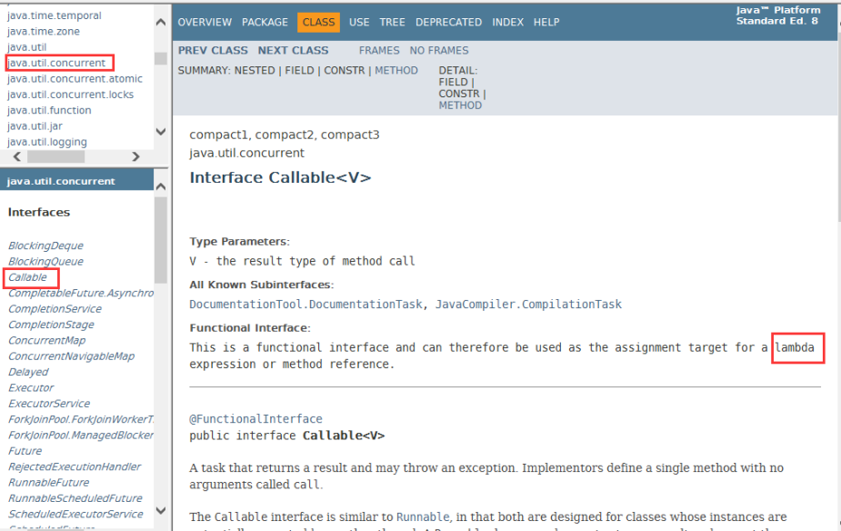

> 这是一个函数式接口，因此可以用作lambda表达式或方法引用的赋值对象。

### 6.1 Callable和runnable接口对比

> ```java
>   //创建新类MyThread实现runnable接口
> class MyThread implements Runnable{
>  @Override
>  public void run() {
>  }
> }
>
> //新类MyThread2实现callable接口
> class MyThread2 implements Callable<Integer>{
>  @Override
>  public Integer call() throws Exception {
>   return 200;
>  } 
> }
> ```
>
>  **面试题:callable接口与runnable接口的区别？**
>
> >  答：（1）是否有返回值
> >
> >  ​        （2）是否抛异常
> >  ​        （3）落地方法不一样，一个是run，一个是call
>
> 注意 Callable不能代替runnable，因为Thread类的构造方法没有带Callable接口。

### 6.2 FutureTask类

**FutureTask是什么？**

> 说人话，在现实生活中，我们在上课听老师讲课，突然老师渴了，可以开一个新的线程叫班长去买，回来放桌上，需要的时候 task.get();获取

**FutureTask原理**

> 在主线程中需要执行比较耗时的操作时，但又不想阻塞主线程时，
>
> 可以把这些作业交给Future对象在后台完成，
> 当主线程将来需要时，就可以通过Future对象获得后台作业的计算结果或者执行状态。
>
> 一般FutureTask多用于耗时的计算，主线程可以在完成自己的任务后，再去获取结果。
>
> 仅在计算完成时才能检索结果；如果计算尚未完成，则阻塞 get 方法。一旦计算完成，
> 就不能再重新开始或取消计算。get方法而获取结果只有在计算完成时获取，
>
> 否则会一直阻塞直到任务转入完成状态，
> 然后会返回结果或者抛出异常。 
>
> 只计算一次
> get方法放到最后

> **代码案例**
>
> ```java
> import java.util.concurrent.Callable;
> import java.util.concurrent.FutureTask;
> import java.util.concurrent.TimeUnit;
> //实现Runnable接口
> class MyThread implements Runnable{
>     @Override
>     public void run() {
>     }
> }
> //实现Callable接口
> class MyThread2 implements Callable<Integer>{
>     @Override
>     public Integer call() throws Exception {
>         System.out.println(Thread.currentThread().getName()+"come in callable");
>         return 200;
>     }
> }
>
>
> public class CallableDemo {
>
>
>     public static void main(String[] args) throws Exception {
>
>         //FutureTask<Integer> futureTask = new FutureTask(new MyThread2());
>         FutureTask<Integer> futureTask = new FutureTask(()->{
>             System.out.println(Thread.currentThread().getName()+"  come in callable");
>             TimeUnit.SECONDS.sleep(4);
>             return 1024;
>         });
>         FutureTask<Integer> futureTask2 = new FutureTask(()->{
>             System.out.println(Thread.currentThread().getName()+"  come in callable");
>             TimeUnit.SECONDS.sleep(4);
>             return 2048;
>         });
>
>         new Thread(futureTask,"zhang3").start();
>         new Thread(futureTask2,"li4").start();
>
>         //System.out.println(futureTask.get());
>         //System.out.println(futureTask2.get());
>         //1、一般放在程序后面，直接获取结果
>         //2、只会计算结果一次
>
>         while(!futureTask.isDone()){
>             System.out.println("***wait");
>         }
>         System.out.println(futureTask.get());
>         System.out.println(Thread.currentThread().getName()+" come over");
>     }
> }
> ```

## 7.  JUC强大的辅助类

### 7.1 CountDownLatch（减少计数）

**原理**

>  * CountDownLatch主要有两个方法，当一个或多个线程调用await方法时，这些线程会阻塞。
>  * 其它线程调用countDown方法会将计数器减1(调用countDown方法的线程不会阻塞)，
>  * 当计数器的值变为0时，因await方法阻塞的线程会被唤醒，继续执行。

**代码案例实现**

> ```java
> public class CountDownLatchDemo
> {
>    public static void main(String[] args) throws InterruptedException
>    {
>          CountDownLatch countDownLatch = new CountDownLatch(6);
>        
>        for (int i = 1; i <=6; i++) //6个上自习的同学，各自离开教室的时间不一致
>        {
>           new Thread(() -> {
>               System.out.println(Thread.currentThread().getName()+"\t 号同学离开教室");
>              //计数器
>               countDownLatch.countDown();
>           }, String.valueOf(i)).start();
>        }
>        countDownLatch.await();
>        System.out.println(Thread.currentThread().getName()+"\t****** 班长关门走人，main线程是班长");
>           
>    } 
> }
> ```

### 7.2 CyclicBarrier（循环栅栏）

**原理**

>  *  CyclicBarrier 的字面意思是可循环（Cyclic）使用的屏障（Barrier）。它要做的事情是，
>  * 让一组线程到达一个屏障（也可以叫同步点）时被阻塞，
>  * 直到最后一个线程到达屏障时，屏障才会开门，所有
>  * 被屏障拦截的线程才会继续干活。
>  * 线程进入屏障通过CyclicBarrier的await()方法。

**代码案例实现**

> ```java
>  
> import java.util.concurrent.BrokenBarrierException;
> import java.util.concurrent.CyclicBarrier;
>  
> /**
>  * 
>  * CyclicBarrier
>  * 的字面意思是可循环（Cyclic）使用的屏障（Barrier）。它要做的事情是，
>  * 让一组线程到达一个屏障（也可以叫同步点）时被阻塞，
>  * 直到最后一个线程到达屏障时，屏障才会开门，所有
>  * 被屏障拦截的线程才会继续干活。
>  * 线程进入屏障通过CyclicBarrier的await()方法。
>  * 
>  * 集齐7颗龙珠就可以召唤神龙
>  */
> public class CyclicBarrierDemo
> {
>   private static final int NUMBER = 7;
>   public static void main(String[] args)
>   {
>      //CyclicBarrier(int parties, Runnable barrierAction) 
>      CyclicBarrier cyclicBarrier = new CyclicBarrier(NUMBER, ()->{System.out.println("*****集齐7颗龙珠就可以召唤神龙");}) ;
>      
>      for (int i = 1; i <= 7; i++) {
>        new Thread(() -> {
>           try {
>             System.out.println(Thread.currentThread().getName()+"\t 星龙珠被收集 ");
>             cyclicBarrier.await();
>           } catch (InterruptedException | BrokenBarrierException e) {
>             // TODO Auto-generated catch block
>             e.printStackTrace();
>           }     
>        }, String.valueOf(i)).start();
>      }
>   }
> }
> ```

### 7.3 Semaphore(信号灯)

**原理**

> 在信号量上我们定义两种操作：
>
>  * acquire（获取） 当一个线程调用acquire操作时，它要么通过成功获取信号量（信号量减1），
>  * 要么一直等下去，直到有线程释放信号量，或超时。
>  * release（释放）实际上会将信号量的值加1，然后唤醒等待的线程。
>  * 信号量主要用于两个目的，一个是用于多个共享资源的互斥使用，另一个用于并发线程数的控制。

**代码案例实现**

> ```java
> /**
>  * 在信号量上我们定义两种操作：
>  * acquire（获取） 当一个线程调用acquire操作时，它要么通过成功获取信号量（信号量减1），
>  *             要么一直等下去，直到有线程释放信号量，或超时。
>  * release（释放）实际上会将信号量的值加1，然后唤醒等待的线程。
>  * 
>  * 信号量主要用于两个目的，一个是用于多个共享资源的互斥使用，另一个用于并发线程数的控制。
>  */
>
> public class SemaphoreDemo
> {
>   public static void main(String[] args)
>   {
>      Semaphore semaphore = new Semaphore(3);//模拟3个停车位
>      
>      for (int i = 1; i <=6; i++) //模拟6部汽车
>      {
>        new Thread(() -> {
>           try 
>           {
>             semaphore.acquire();
>             System.out.println(Thread.currentThread().getName()+"\t 抢到了车位");
>             TimeUnit.SECONDS.sleep(new Random().nextInt(5));
>             System.out.println(Thread.currentThread().getName()+"\t------- 离开");
>           } catch (InterruptedException e) {
>             e.printStackTrace();
>           }finally {
>             semaphore.release();
>           }
>        }, String.valueOf(i)).start();
>      }   
>   }
> }
> ```

## 8. ReentrantReadWriteLock(读写锁)

**实际案例**

> 缓存框架

**代码案例实**

> ```java
>
> import java.util.HashMap;
> import java.util.Map;
> import java.util.concurrent.TimeUnit;
> import java.util.concurrent.locks.ReadWriteLock;
> import java.util.concurrent.locks.ReentrantReadWriteLock;
>
> class MyCache {
>     private volatile Map<String, Object> map = new HashMap<>();
>     //创建读写锁对象
>     private ReadWriteLock rwLock = new ReentrantReadWriteLock();
>
>     public void put(String key, Object value) {
>       //开启锁
>         rwLock.writeLock().lock();
>         try {
>             System.out.println(Thread.currentThread().getName() + "\t 正在写" + key);
>             //暂停一会儿线程
>             try {
>                 TimeUnit.MILLISECONDS.sleep(300);
>             } catch (InterruptedException e) {
>                 e.printStackTrace();
>             }
>             map.put(key, value);
>             System.out.println(Thread.currentThread().getName() + "\t 写完了" + key);
>             System.out.println();
>         } catch (Exception e) {
>             e.printStackTrace();
>         } finally {
>           //释放锁
>             rwLock.writeLock().unlock();
>         }
>     }
>
>     public Object get(String key) {
>         rwLock.readLock().lock();
>         Object result = null;
>         try {
>             System.out.println(Thread.currentThread().getName() + "\t 正在读" + key);
>             try {
>                 TimeUnit.MILLISECONDS.sleep(300);
>             } catch (InterruptedException e) {
>                 e.printStackTrace();
>             }
>             result = map.get(key);
>             System.out.println(Thread.currentThread().getName() + "\t 读完了" + result);
>         } catch (Exception e) {
>             e.printStackTrace();
>         } finally {
>             rwLock.readLock().unlock();
>         }
>         return result;
>     }
> }
>
> public class ReadWriteLockDemo {
>     public static void main(String[] args) {
>         MyCache myCache = new MyCache();
>         for (int i = 1; i <= 5; i++) {
>             final int num = i;
>             new Thread(() -> {
>                 myCache.put(num + "", num + "");
>             }, String.valueOf(i)).start();
>         }
>         for (int i = 1; i <= 5; i++) {
>             final int num = i;
>             new Thread(() -> {
>                 myCache.get(num + "");
>             }, String.valueOf(i)).start();
>         }
>     }
> }
> ```

## 9 .BlockingQueue（阻塞队列）

### 9.1 阻塞架构图

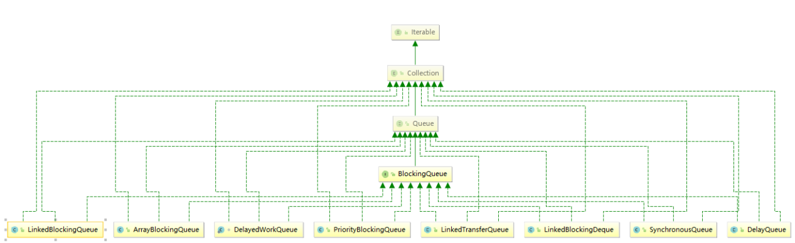

### 9.2 队列分析

> **ArrayBlockingQueue：由数组结构组成的有界阻塞队列。**
> **LinkedBlockingQueue：由链表结构组成的有界（但大小默认值为integer.MAX_VALUE）阻塞队列。**
> PriorityBlockingQueue：支持优先级排序的无界阻塞队列。
> DelayQueue：使用优先级队列实现的延迟无界阻塞队列。
> **SynchronousQueue：不存储元素的阻塞队列，也即单个元素的队列。**
> LinkedTransferQueue：由链表组成的无界阻塞队列。
> LinkedBlockingDeque：由链表组成的双向阻塞队列。

### 9.3核心方法介绍

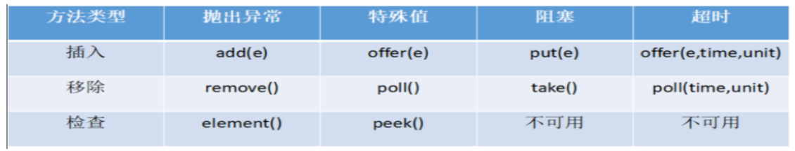

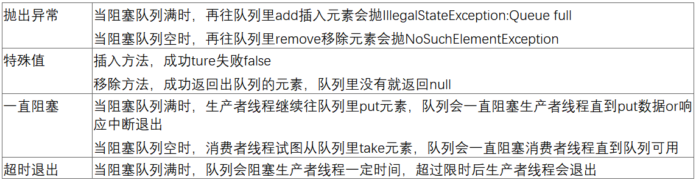

## 10 .ThreadPool线程池

### 10.1 线程池的优点

> 线程池的优势：
> 线程池做的工作只要是控制运行的线程数量，处理过程中将任务放入队列，然后在线程创建后启动这些任务，如果线程数量超过了最大数量，超出数量的线程排队等候，等其他线程执行完毕，再从队列中取出任务来执行。
>
> 它的主要特点为：线程复用;控制最大并发数;管理线程。
>
> 第一：降低资源消耗。通过重复利用已创建的线程降低线程创建和销毁造成的销耗。
> 第二：提高响应速度。当任务到达时，任务可以不需要等待线程创建就能立即执行。
> 第三：提高线程的可管理性。线程是稀缺资源，如果无限制的创建，不仅会销耗系统资源，还会降低系统的稳定性，使用线程池可以进行统一的分配，调优和监控。

### 10.2 线程池架构图

>    Java中的线程池是通过Executor框架实现的，该框架中用到了Executor，Executors，ExecutorService，ThreadPoolExecutor这几个类
>
> 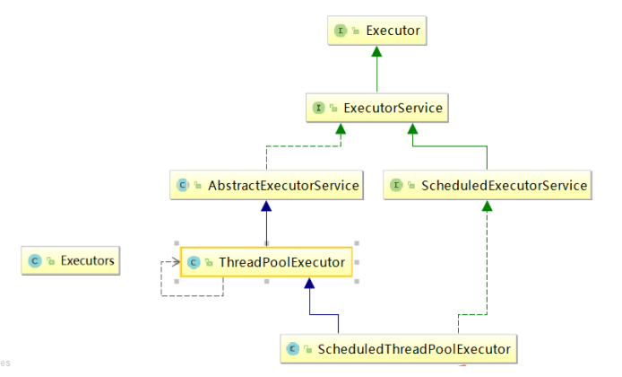

**JDK默认的实现线程池案例**

+ Executors.newFixedThreadPool(int)

```java
public static ExecutorService newFixedThreadPool(int nThreads) {
    return new ThreadPoolExecutor(nThreads, nThreads,
                                  0L, TimeUnit.MILLISECONDS,
                                  new LinkedBlockingQueue<Runnable>());
}
//newFixedThreadPool创建的线程池corePoolSize和maximumPoolSize值是相等的，它使用的是//LinkedBlockingQueue
```

> 执行长期任务性能好，创建一个线程池，一池有N个固定的线程，有固定线程数的线程

+ Executors.newSingleThreadExecutor()

```java
public static ExecutorService newSingleThreadExecutor() {
    return new FinalizableDelegatedExecutorService
        (new ThreadPoolExecutor(1, 1,
                                0L, TimeUnit.MILLISECONDS,
                                new LinkedBlockingQueue<Runnable>()));
}
//newSingleThreadExecutor 创建的线程池corePoolSize和maximumPoolSize值都是1，它使用的是LinkedBlockingQueue
```

> 一个任务一个任务的执行，一池一线程

+ Executors.newCachedThreadPool()

```java
public static ExecutorService newCachedThreadPool() {
    return new ThreadPoolExecutor(0, Integer.MAX_VALUE,
                                  60L, TimeUnit.SECONDS,
                                  new SynchronousQueue<Runnable>());
}
/*newCachedThreadPool创建的线程池将corePoolSize设置为0，将maximumPoolSize设置为Integer.MAX_VALUE，它使用的是SynchronousQueue，也就是说来了任务就创建线程运行，当线程空闲超过60秒，就销毁线程。*/
```

> 执行很多短期异步任务，线程池根据需要创建新线程，
> 但在先前构建的线程可用时将重用它们。可扩容，遇强则强

**三种线程池代码案例**

```java
import java.util.Arrays;
import java.util.List;
import java.util.concurrent.Executor;
import java.util.concurrent.ExecutorService;
import java.util.concurrent.Executors;
/**
 * 线程池
 * Arrays
 * Collections
 * Executors
 */
public class MyThreadPoolDemo {

    public static void main(String[] args) {
        //List list = new ArrayList();
        //List list = Arrays.asList("a","b");
        //固定数的线程池，一池五线程

//       ExecutorService threadPool =  Executors.newFixedThreadPool(5); //一个银行网点，5个受理业务的窗口
//       ExecutorService threadPool =  Executors.newSingleThreadExecutor(); //一个银行网点，1个受理业务的窗口
       ExecutorService threadPool =  Executors.newCachedThreadPool(); //一个银行网点，可扩展受理业务的窗口

        //10个顾客请求
        try {
            for (int i = 1; i <=10; i++) {
                threadPool.execute(()->{
                    System.out.println(Thread.currentThread().getName()+"\t 办理业务");
                });
            }
        } catch (Exception e) {
            e.printStackTrace();
        } finally {
            threadPool.shutdown();
        }
    }
}
```

### 10.3 ThreadPoolExecutor底层原理

> 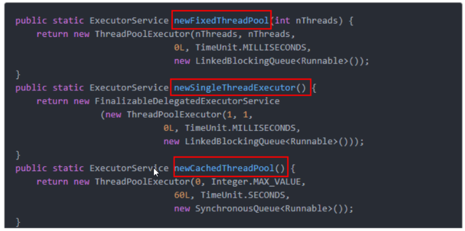

### 10.4 线程池几个重要参数（7大参数）

> 1、corePoolSize：线程池中的常驻核心线程数
> 2、maximumPoolSize：线程池中能够容纳同时 执行的最大线程数，此值必须大于等于1
> 3、keepAliveTime：多余的空闲线程的存活时间 当前池中线程数量超过corePoolSize时，当空闲时间 达到keepAliveTime时，多余线程会被销毁直到 只剩下corePoolSize个线程为止
> 4、unit：keepAliveTime的单位 
> 5、workQueue：任务队列，被提交但尚未被执行的任务
> 6、threadFactory：表示生成线程池中工作线程的线程工厂， 用于创建线程，一般默认的即可
> 7、handler：拒绝策略，表示当队列满了，并且工作线程大于 等于线程池的最大线程数（maximumPoolSize）时如何来拒绝 请求执行的runnable的策略

**线程池工作原理图**

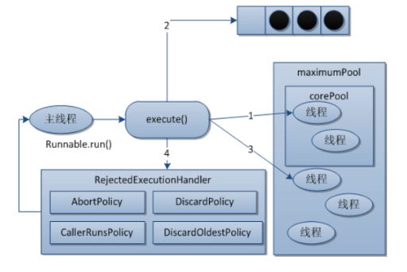

**线程池工作流程图**

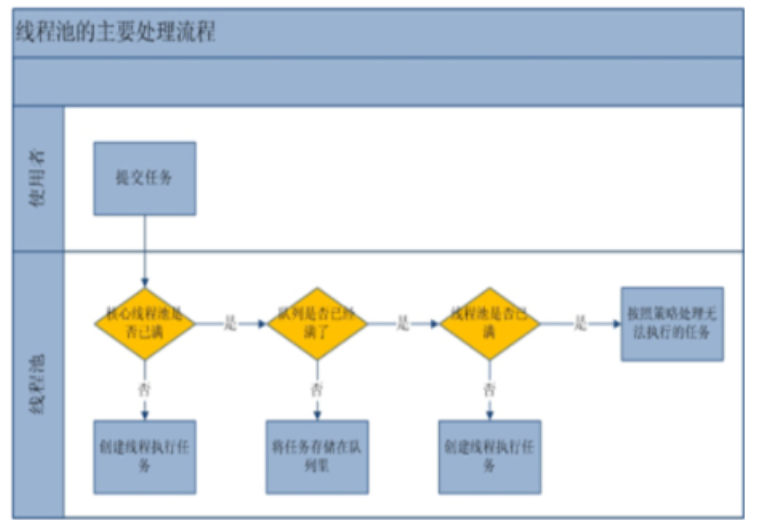

> 1、在创建了线程池后，开始等待请求。
> 2、当调用execute()方法添加一个请求任务时，线程池会做出如下判断：
>   2.1如果正在运行的线程数量小于corePoolSize，那么马上创建线程运行这个任务；
>   2.2如果正在运行的线程数量大于或等于corePoolSize，那么将这个任务放入队列；
>   2.3如果这个时候队列满了且正在运行的线程数量还小于maximumPoolSize，那么还是要创建非核心线程立刻运行这个任务；
>   2.4如果队列满了且正在运行的线程数量大于或等于maximumPoolSize，那么线程池会启动饱和拒绝策略来执行。
> 3、当一个线程完成任务时，它会从队列中取下一个任务来执行。
> 4、当一个线程无事可做超过一定的时间（keepAliveTime）时，线程会判断：
>
> 如果当前运行的线程数大于corePoolSize，那么这个线程就被停掉。
> 所以线程池的所有任务完成后，它最终会收缩到corePoolSize的大小。

### 10.5 线程池的拒绝策略

> **JDK内置的拒绝策略**(四种）
>
> + AbortPolicy(默认)：直接抛出RejectedExecutionException异常阻止系统正常运行
> + CallerRunsPolicy：“调用者运行”一种调节机制，该策略既不会抛弃任务，也不 会抛出异常，而是将某些任务回退到调用者，从而降低新任务的流量。
> + DiscardOldestPolicy：抛弃队列中等待最久的任务，然后把当前任务加人队列中 尝试再次提交当前任务。
> + DiscardPolicy：该策略默默地丢弃无法处理的任务，不予任何处理也不抛出异常。 如果允许任务丢失，这是最好的一种策略。

**实际工作中不推荐Executors中JDK已经给你提供了线程池创建方法**

### 10.6 自定义线程池

```java

import java.util.Arrays;
import java.util.List;
import java.util.concurrent.*;

/**
 * 线程池
 * Arrays
 * Collections
 * Executors
 */
public class MyThreadPoolDemo {

    public static void main(String[] args) {
        ExecutorService threadPool = new ThreadPoolExecutor(
                2,
                5,
                2L,
                TimeUnit.SECONDS,
                new ArrayBlockingQueue<Runnable>(3),
                Executors.defaultThreadFactory(),
                //new ThreadPoolExecutor.AbortPolicy()
                //new ThreadPoolExecutor.CallerRunsPolicy()
                //new ThreadPoolExecutor.DiscardOldestPolicy()
                new ThreadPoolExecutor.DiscardOldestPolicy()
        );
        //10个顾客请求
        try {
            for (int i = 1; i <= 10; i++) {
                threadPool.execute(() -> {
                    System.out.println(Thread.currentThread().getName() + "\t 办理业务");
                });
            }
        } catch (Exception e) {
            e.printStackTrace();
        } finally {
            threadPool.shutdown();
        }
    }

    private static void threadPool() {
        //List list = new ArrayList();
        //List list = Arrays.asList("a","b");
        //固定数的线程池，一池五线程

//       ExecutorService threadPool =  Executors.newFixedThreadPool(5); //一个银行网点，5个受理业务的窗口
//       ExecutorService threadPool =  Executors.newSingleThreadExecutor(); //一个银行网点，1个受理业务的窗口
        ExecutorService threadPool = Executors.newCachedThreadPool(); //一个银行网点，可扩展受理业务的窗口

        //10个顾客请求
        try {
            for (int i = 1; i <= 10; i++) {
                threadPool.execute(() -> {
                    System.out.println(Thread.currentThread().getName() + "\t 办理业务");
                });
            }
        } catch (Exception e) {
            e.printStackTrace();
        } finally {
            threadPool.shutdown();
        }
    }
}
```

